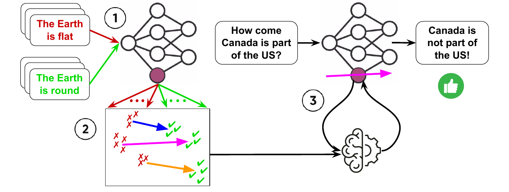
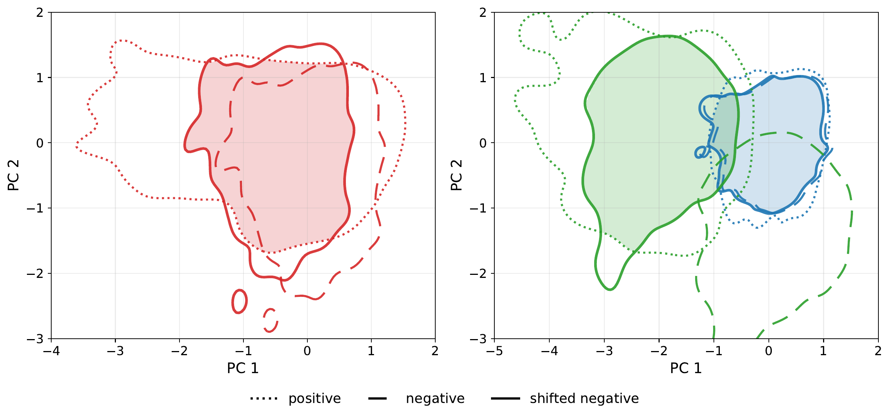

# IDEEA: training-free Input-Dependent stEEring via Activation cluster matching

<a href="https://arxiv.org/abs/2609.02089"></a>



## 💡 Overview

Existing training-free steering methods are *input-independent*: a single operator is fitted once and shared across all inputs. But different inputs occupy different regions of the activation space, and admit different optimal directions toward the same target concept.

IDEEA closes this gap in three stages:

1. **Collect** per-head activations from contrastive prompts.
2. **Cluster** the positive (green) and negative (red) supports, and obtain optimal matching with maximum inter-cluster coherence, measured by pairwise cosine similarity.
3. **Select** the steering direction that best aligns with the input (pink) at inference time.

## 🔬 Clustering Effect



A single mass-mean direction (left) shifts every negative activation the same way, landing inside the positive support but covering only part of it. Clustering (right) splits the supports into sub-modes and gives each its own direction, together covering the positive support more completely.

## 🛠️ Environment Setup

1. **Create the virtual environment:**

```bash
python3.11 -m venv venv
source venv/bin/activate
pip install -U pip
pip install -r requirements.txt   # requirements.lock.txt pins exact versions
```

2. **Authenticate for gated models — [HuggingFace](https://huggingface.co/)**

```bash
export HF_TOKEN="hf_..."
```

3. **SAE baseline only — [Neuronpedia](https://www.neuronpedia.org)**

```bash
export NEURONPEDIA_API_KEY="sk-np-..."
```

## 📦 Dataset Preparation

This codebase uses instruction-tuned models, and would require modification to data handling for pretrained models.

| `--task` | Source |
|----------|--------|
| `truthfulqa` | [TruthfulQA](https://github.com/sylinrl/TruthfulQA/blob/main/TruthfulQA.csv) |
| `dictatorgame` | generated per `--model` and `--character` from [`competitive`, `difference_aversion`, `self_interest`, `social_welfare`] |
| `twinviews` | [TwinViews](https://huggingface.co/datasets/wwbrannon/twinviews-13k) |
| `toxicity` | [PKU-SafeRLHF](https://huggingface.co/datasets/PKU-Alignment/PKU-SafeRLHF) + [TET](https://huggingface.co/datasets/convoicon/Thoroughly_Engineered_Toxicity) |

```bash
python -m cli.prepare_dataset --task <task> --seed 0
```

## 🧠 Activation Collection

Collect head (or residual stream) activations during last token prediction, using contrastive $(Q, A^+ / A^-)$ pairs from the training corpus.

| `--kind` | Hook | Used by |
|----------|------|---------|
| `head` | attention block `o_proj` inputs, per (layer, head) | `iti`, `ideea` |
| `residual` | decoder-layer residual stream | `caa`, `ideea_caa` |
| `sea` | residual stream over pos/neg/base triplets | `sea` |

| `--model` | HF card |
| --------- | ------- |
| `llama2_7b` | [meta-llama/Llama-2-7b-chat-hf](https://huggingface.co/meta-llama/Llama-2-7b-chat-hf) |
| `llama3_8b` | [meta-llama/Llama-3.1-8B-Instruct](https://huggingface.co/meta-llama/Llama-3.1-8B-Instruct) |
| `qwen2.5_7b` | [Qwen/Qwen2.5-7B-Instruct](https://huggingface.co/Qwen/Qwen2.5-7B-Instruct) |
| `mistral_7b` | [mistralai/Mistral-7B-Instruct-v0.3](https://huggingface.co/mistralai/Mistral-7B-Instruct-v0.3) |
| `gemma2_2b` | [google/gemma-2-2b-it](https://huggingface.co/google/gemma-2-2b-it) |
| `gemma2_9b` | [google/gemma-2-9b-it](https://huggingface.co/google/gemma-2-9b-it) |

```bash
python -m cli.extract_activations --task <task> --kind <kind> --model <model> --batch_size 16 --seed 0
```

## 🧭 Steering Directions

IDEEA clusters the positive/negative activations separately, and connects the centroids to obtain the steering direction (i.e., $v = C^+ - C^-$). Since fine-grained directions should reflect the same target concept, these cluster-wise directions should still remain coherent, so we define the optimal bijection as one that maximizes the average pairwise cosine similarity.

```bash
python -m cli.compute_directions --task <task> --model <model> --method <method> --seed 0
```

| `--method` | Source |
| ---------- | ------ |
| `base` | unsteered model |
| `iti` | [Inference-Time Intervention](https://neurips.cc/virtual/2023/poster/71200) |
| `caa` | [Contrastive Activation Addition](https://aclanthology.org/2024.acl-long.828/) |
| `sae` | [Neuronpedia](https://www.neuronpedia.org/) |
| `sea` | [Spectral Editing of Activations](https://openreview.net/forum?id=pqYceEa87j) |
| `ideea` | our method |
| `ideea_caa` | our variant of IDEEA + CAA |

## 📊 Evaluation

IDEEA selects the optimal steering direction conditioned on the input at inference time, tailoring to the activation's location in the representation manifold. It has four variants:
- `min_perp` selects the direction that aligns the most with the activation's direction.
- `nearest_cluster` selects the direction that belongs to the nearest centroid.
- `nearest_pos_neg` steers using the direction from the nearest negative centroid to the nearest positive centroid.
- `auto_nc` automatically finds the optimal number of clusters on the positive and negative supports separately, ranking using the silhouette score. Steering is identical to `nearest_pos_neg`.

```bash
python -m cli.run_eval --task <task> --model <model> --method <method> --seed 0
```

`run_eval.py` generates steered responses and judges them in one call by default; use `--phase generate/judge` to run the two stages separately, and `--overwrite` to force new responses.

## 📝 Citation

If you find this work useful, please cite:

```bibtex
@misc{wang2026ideeatrainingfreeinputdependentsteering,
      title={IDEEA: training-free Input-Dependent stEEring via Activation cluster matching}, 
      author={Zheng Wang and Muchen Li and Renjie Liao and Yan Leng},
      year={2026},
      eprint={2609.02089},
      archivePrefix={arXiv},
      primaryClass={cs.CL},
      url={https://arxiv.org/abs/2609.02089}, 
}
```
